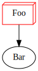

# Getting Started

This guide explains how to use `graphviz` to generate graphs.

## Installation

Firstly, add the gem to your project:

~~~ bash
$ bundle add graphviz
~~~

## Simple Example

This sample code generates a SVG graph:

~~~ ruby
require 'graphviz';

graph = Graphviz::Graph.new

foo = graph.add_node("Foo")
foo.add_node("Bar")

foo.attributes[:shape] = 'box3d'
foo.attributes[:color] = 'red'

# Dump the dot data:
# puts graph.to_dot

# Process the graph to output:
Graphviz.output(graph, path: "test.svg", format: 'svg')
~~~

### Output

<figure>
	
</figure>